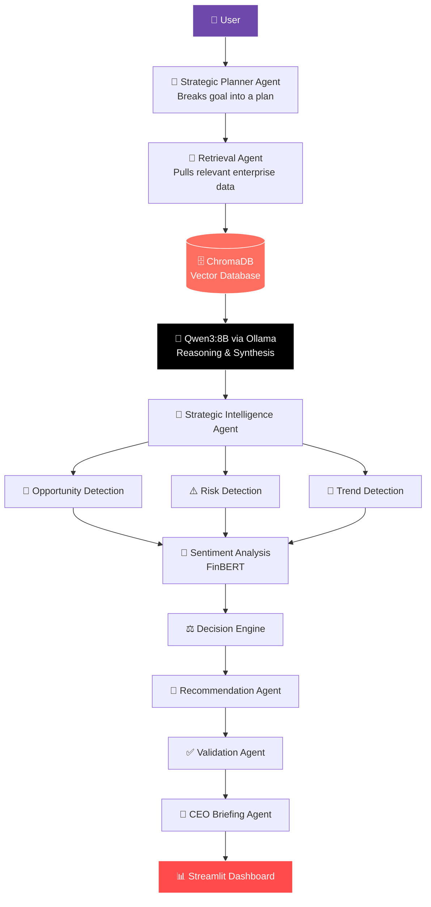

# 🧠 Executive Strategic Intelligence Dashboard

---

## 📌 Overview

**Executive Strategic Intelligence Dashboard** is an AI-powered, multi-agent decision support platform built to assist executive management by analysing enterprise intelligence and generating evidence-based strategic recommendations. It combines **Retrieval-Augmented Generation (RAG)**, **Large Language Models (LLMs)**, **sentiment analysis**, and a coordinated multi-agent architecture to retrieve enterprise knowledge, surface strategic opportunities and risks, track market trends, and produce executive-ready briefings.

The platform is built to answer one defining executive challenge:

> 💬 *"What strategic actions should management prioritize next, and why?"*

It distills scattered enterprise intelligence into a single, evidence-grounded executive narrative that leadership can act on with confidence.

---

## 🎯 Project Objectives

- Collect strategic intelligence from enterprise data sources.
- Build a searchable enterprise knowledge base.
- Generate evidence-based strategic insights.
- Identify opportunities, risks, and emerging technology trends.
- Analyse market sentiment around the business.
- Produce prioritized strategic recommendations.
- Generate CEO-level executive briefings.
- Support executive decision-making through a multi-agent AI pipeline.

---

## 🏢 The Business Problem

Executives are overwhelmed by unstructured information arriving from dozens of disconnected channels:

| Source | Signal Type |
|--------|-------------|
| 📰 Company News | Announcements, product launches |
| 🏭 Industry News | Market shifts, regulatory changes |
| 🤖 Technology News | Emerging technologies & trends |
| 🥊 Competitor Activity | Competitive positioning |
| 📊 Market Reports | Macro and sector dynamics |

Reading all of it is impossible. Synthesizing it into a confident decision is harder still. **This platform automates the retrieve → analyse → decide → recommend → validate workflow**, delivering distilled, defensible intelligence to leadership instead of raw, unfiltered noise.

---

## ✨ Core Features

### 🏢 Company Overview

A high-level snapshot of the business being monitored:

- Company name
- Industry
- Number of collected documents
- Number of data sources
- Last update timestamp

### 📰 Market Intelligence

Provides enterprise intelligence including:

| Module | Output |
|--------|--------|
| Recent News | Latest relevant developments |
| Competitor Activities | Tracked competitive moves |
| Emerging Technologies | Trend radar |
| Company Announcements | Official signals |

### 🚀 Opportunity Monitor

Automatically identifies strategic opportunities, each with:

- ⭐ Opportunity title
- 📝 Description
- 📈 Impact level
- 📎 Supporting evidence
- 🎯 Confidence score

### ⚠️ Risk Monitor

Identifies strategic risks, each with:

- ⚠️ Risk title
- 🗂️ Risk category
- 🛡️ Severity level
- 📎 Supporting evidence
- 🎯 Confidence score

### 🔬 Technology & Trend Monitor

Tracks important strategic technology trends, including:

- 🔬 Technology trends
- 🤖 Emerging enterprise technologies
- 📎 Supporting evidence
- 🎯 Confidence score

### 💚 Sentiment Analysis

Uses **FinBERT** to analyse retrieved business articles:

| View | Description |
|------|-------------|
| **News Sentiment** | Derived from collected business news articles. |
| **Public Sentiment** | Derived from broader public-facing intelligence. |
| **Overall Sentiment** | Combined strategic sentiment score. |
| **Sentiment Trend** | Direction of sentiment over time. |

Visualisations include a sentiment distribution chart and a sentiment comparison chart.

### 🧩 Strategic Recommendations

Each recommendation is delivered with:

- ⭐ **Priority ranking**
- 📈 **Expected business impact**
- 📎 **Supporting evidence**
- 🛡️ **Risk level**

### 👔 CEO Briefing

A dedicated agent that automatically generates an executive summary answering:

- 💬 What happened?
- 🎯 Why does it matter?
- 🧭 What should management do next?

---

## 🏗️ Architecture



---

## 🤖 Multi-Agent Workflow

The end-to-end reasoning pipeline:

1. **Goal** — the executive question is captured
2. **Plan** — the Strategic Planner Agent breaks it into steps
3. **Retrieve** — relevant enterprise knowledge is pulled from ChromaDB
4. **Analyse** — the Strategic Intelligence Agent detects opportunities, risks, and trends
5. **Decide** — the Decision Engine weighs findings against sentiment
6. **Recommend** — the Recommendation Agent drafts prioritized actions
7. **Validate** — the Validation Agent checks evidence and accuracy
8. **Brief** — the CEO Briefing Agent composes the executive narrative
9. **Serve** — results are presented through the Streamlit dashboard

---

## 📸 Dashboard Preview

> Replace the placeholders below with screenshots from your running dashboard.

### 🏢 Company Overview


### 📰 Market Intelligence


### 🚀 Opportunity & ⚠️ Risk Monitor


### 🎯 Strategic Recommendations


### 👔 CEO Briefing


### 💚 Sentiment Analysis


---

## 📈 Project Highlights

- 🧠 **Multi-agent architecture** — planner, retrieval, intelligence, decision, recommendation, validation, and briefing agents
- 🗄️ **ChromaDB** semantic search engine
- 🧠 **Retrieval-Augmented Generation (RAG)** architecture
- 🤖 **Qwen3:8B** local strategic reasoning via Ollama
- 💚 **FinBERT**-powered sentiment analysis
- 🎯 **Evidence-grounded recommendations**
- 👔 **Automated CEO briefing generation**
- 📊 **Interactive Streamlit dashboard**

---

## 🧰 Technology Stack

| Layer | Technology |
|-------|------------|
| 🖥️ **Frontend** | Streamlit |
| ⚙️ **Backend** | Python |
| 🧠 **AI / NLP** | Ollama · Qwen3:8B · Sentence Transformers |
| 💚 **Sentiment Analysis** | FinBERT |
| 🗄️ **Vector Database** | ChromaDB |
| 📊 **Data Processing** | Pandas |
| 📈 **Visualization** | Plotly |

---

## 📊 Dashboard Sections

| # | Section | Purpose |
|---|---------|---------|
| 1 | 🏢 **Company Overview** | High-level company snapshot |
| 2 | 📰 **Market Intelligence** | News, competitors & technology trends |
| 3 | 🚀 **Opportunity Monitor** | Evidence-backed strategic opportunities |
| 4 | ⚠️ **Risk Monitor** | Evidence-backed strategic risks |
| 5 | 🔬 **Technology & Trend Monitor** | Emerging technologies to watch |
| 6 | 🎯 **Strategic Recommendations** | Prioritized actions with impact & risk |
| 7 | 👔 **CEO Briefing** | Executive narrative & next moves |
| 8 | 💚 **Sentiment Analysis** | News, public & overall sentiment outlook |

---

## 📁 Project Structure

```
ai_ceo_agent/
│
├── agents/
│   ├── planner.py                  # 🧭 Strategic planning agent
│   ├── strategic_agent.py          # 🧠 Opportunity / risk / trend detection
│   ├── decision_engine.py          # ⚖️ Decision logic
│   ├── validator.py                # ✅ Evidence validation
│   └── memory.py                   # 🧩 Agent memory
│
├── dashboard/
│   └── new.py                      # 📊 Streamlit dashboard entry point
│
├── data/                           # 🧹 Collected & processed documents
│
├── tools/
│   ├── retrieval_tool.py           # 🔎 ChromaDB retrieval
│   ├── intelligence_tool.py        # 🧭 Strategic intelligence engine
│   ├── recommendation_tool.py      # 🎯 Recommendation generation
│   ├── sentiment_tool.py           # 💚 FinBERT sentiment analysis
│   └── ceo_tool.py                 # 👔 CEO briefing generation
│
├── vector_db/                      # 🗄️ ChromaDB persistent store
│
├── requirements.txt
└── README.md
```

---

## ⚙️ Installation

Clone the repository

```bash
git clone https://github.com/yourusername/ai_ceo_agent.git
```

Navigate into the project

```bash
cd ai_ceo_agent
```

Create a virtual environment

```bash
python -m venv venv
```

Activate it

**Windows**
```bash
venv\Scripts\activate
```

**Linux / macOS**
```bash
source venv/bin/activate
```

Install dependencies

```bash
pip install -r requirements.txt
```

---

## 🦙 Install Ollama

Download Ollama from [ollama.com/download](https://ollama.com/download)

Pull the Qwen model

```bash
ollama pull qwen3:8b
```

Start Ollama

```bash
ollama serve
```

---

## ▶️ Running the Dashboard

```bash
streamlit run dashboard/new.py
```

---

## ❓ Example Questions

The dashboard can answer strategic questions such as:

- 🚀 What are the major opportunities for SAP?
- ⚠️ What are the biggest business risks?
- 🥊 What are competitors doing?
- 🔬 Which technologies should management monitor?
- 🎯 What strategic actions should be prioritised?
- 📎 What evidence supports these recommendations?

---

## ✅ Results

The Executive Strategic Intelligence Dashboard successfully transforms large volumes of enterprise intelligence into actionable executive insights.

The system produces:

- Strategic opportunities
- Strategic risks
- Technology trends
- Market intelligence
- Sentiment analysis
- Evidence-backed strategic recommendations
- CEO-level executive briefings

All outputs are generated using a **Retrieval-Augmented Generation (RAG)** pipeline and supported by evidence retrieved from the enterprise knowledge base.

---

## 🗺️ Future Enhancements

- Live news ingestion
- Real-time competitor monitoring
- Automated alert system
- Predictive trend forecasting
- Interactive executive reports
- Multi-company support
- Cloud deployment

---

## 👤 Author

**Kalhara**
MSc Artificial Intelligence

<div align="center">

---

⭐ *If this project sparked an idea, consider giving it a star.* ⭐

*Built with RAG, local LLMs, and a focus on decisions that matter.*

</div>

---

## 📄 License

This project is developed for academic purposes as part of an MSc research project.
